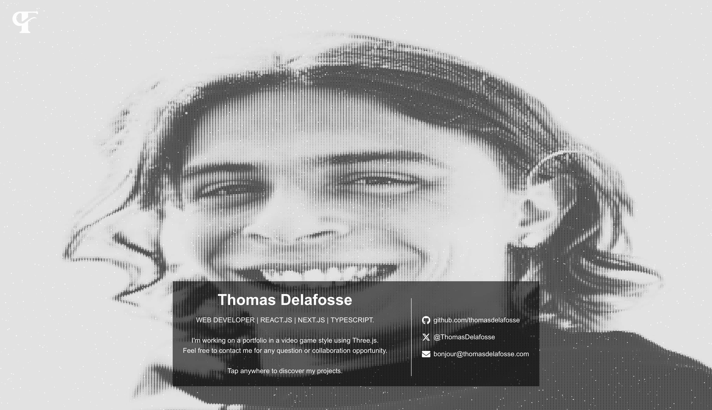

## Thomas Delafosse – Portfolio

A personal portfolio built with Next.js page router, React, TypeScript, and Three.js. It features 3D carousel, a pointillism-inspired background with particles morphing area.

### Preview



### Tech stack

- **Framework**: Next.js 15, React 19, TypeScript
- **3D / Graphics**: three.js, @react-three/fiber, @react-three/drei
- **UI / Styling**: Tailwind CSS 4
- **Tooling**: ESLint 9, Vercel Analytics & Speed Insights

### Notable features

- **3D carousel** with GLB models (`src/components/carousel-3d/*`)
- **Pointillism background** with custom GLSL shaders (`src/components/ui-background-pointillisme/*`)

### Project structure (excerpt)

```text
src/
  components/
    carousel-3d/
    image-carousel/
    info-section/
    main-section/
    ui-background-pointillisme/
  data/
  hooks/
  pages/
  styles/
```

### Scripts

- **yarn install**: install the packages
- **yarn dev**: start the dev server with Turbopack
- **yarn build**: create a production build
- **yarn start**: run the production server
- **yarn lint**: run ESLint
